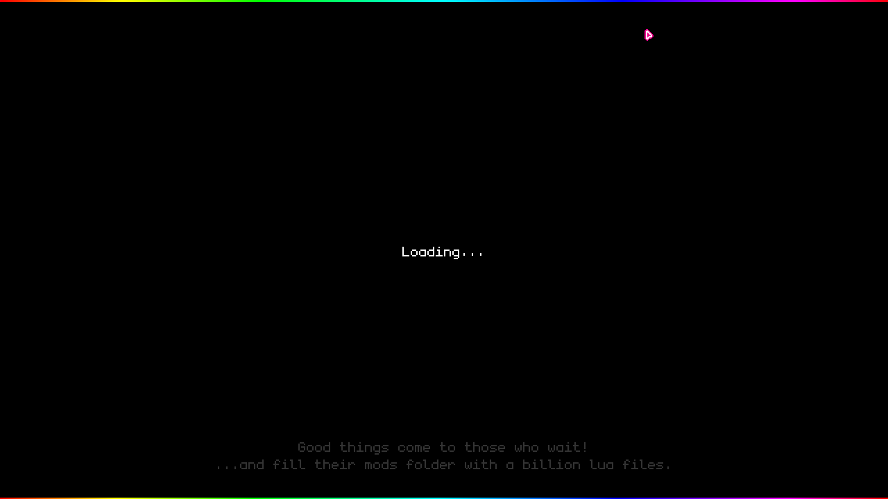

# Introduction

Sunrise v2026.5.0 introduces a fully-integrated modding system in the game, using the Lua programming language.
Specifically, Sunrise's Lua integration was built on the foundation of [Lua 5.4.8](https://www.lua.org/versions.html#5.4), and as such, some features available in Lua 5.5 and above are not currently available.

## What is Lua for Sunrise?

When opening Sunrise for the first time, the game will create three directories in the game's save folder (whether that be `%appdata%\Sunrise` or something else, it mostly depends on your system's configuration, and whether or not the game is being ran on Windows or emulated through Wine or Valve's Proton emulator). The one you'll need to look through is the "mods" directory. This is where you can find, store, and create mods for Sunrise that are instantly detected and loaded upon game boot. **Please be aware: the game WILL load ANY Lua file placed in there.**

*Sunrise is also not compatible with Luau, the variation of Lua used by Roblox.*

Any lag experienced upon game boot due to loading Lua files will show this screen, before proceeding to the in-game content warnings:


## Getting Started

To start, simply create a .lua file in the folder. For this example, the code below will print to the `latest_log.txt` file present in the root of the game's save folder:
```
game_call('PrintToLog', string.format("Hello World!"))
```

Save it and run the game. You should find `LUA: Hello World!` sent to the output in the file amongst the rest of the game's normal logging.
This file will also be recognized in the game's "Mods" menu, which can be accessed below the Settings on the Main Menu.

## Limitations

There are a few important things to remember when developing in Lua for Sunrise:
1. Sunrise is **sandboxed.**. This means any file operations ran can only apply within the game's save folder, with operations outside of the folder returning with "Access Denied".
2. Lua's native `print()` function will print to the game's output, but can only be seen if running the game within the GameMaker IDE, which obviously isn't possible.
3. If playing through Steam, all abilities to earn achievements will be disabled whenever ANY mod is active.
4. When interacting with objects, the objects specified MUST exist, otherwise the code will crash Sunrise.
5. You cannot use Lua libraries that use `require()`, nor can you use `io`, `os`, or `debug` functions.

## Interacting with Sunrise

As you saw above, `game_call` is your key to interacting with the game and the main function you'll be using often. There are a number of built-in functions associated with `game_call`.
The list, as of v2026.5.0, includes:

### PrintToLog
Allows for the script to print directly to the game's log file, serves as the replacement to Lua's native `print()` function.
```
game_call('PrintToLog', string.format("Hello World!"))
```

The code above will print "Hello World!" prefixed with `LUA:` to the game's logs.

### GetCurrentRoom
Gets the current room the game is in.
```
game_call('GetCurrentRoom', string.format(""))
```

The code above is self-explanatory. For example, if you were in the Main Menu, this would return with `rm_menu`.
This can be hooked onto a variable:
```
room = game_call('GetCurrentRoom', string.format(""))
print(tostring(room))
```

The code above will store the current room to a variable titled `room`, then print it to the IDE output.

### SetCurrentRoom
Switches the game's current room.
```
game_call('SetCurrentRoom', string.format("rm_menu"))
```

The code above will set the current room to `rm_menu`, which is the Main Menu.
This can also be hooked onto a variable, where the room you switch to will also be the result:
```
room = game_call('SetCurrentRoom', string.format("rm_menu"))
print(tostring(room))
```

The code above switches the room to `rm_menu` and stores that into the `room` variable, then prints it to the IDE output.

### SpawnObject
Creates an object on a depth level of zero.
```
game_call('SpawnObject', string.format("obj_solid_object, 64, 32"))
```

The code above will create a solid collision object at X: 64, Y: 32 in the current room.
This can be hooked onto variables, where the resulting object created will be the result:
```
object = game_call('SpawnObject', string.format("obj_solid_object, 64, 32"))
print(tostring(object))
```

The code above will store the created `obj_solid_object` to the `object` variable, then print it to the IDE output.

### RemoveObject
Deletes all instances of an object in a room.
```
game_call('RemoveObject', string.format("obj_solid_object"))
```

The code above will remove every instance of `obj_solid_object` spawned in. The result of this line is always zero.

### GetObjectVariable
Gets the value of a variable present in an object. Returns -1 if said variable doesn't exist in the object specified.
```
valueofvar = game_call('GetObjectVariable', string.format("obj_col1, collision_flag"))
```

The code above will store the value of `obj_col` (collision tag)'s `collision_flag` game object variable in a `valueofvar` Lua variable.
In this case, it would return `true`.

### SetObjectVariable
Allows for changing existing variables in an object. If it doesn't exist, it simply returns as -1, otherwise it returns the new value of the variable you just set.
```
valueofvar = game_call('SetObjectVariable', string.format("obj_col1, collision_flag, false"))
```

The code above will set the `collision_flag` game object variable in `obj_col1` to `false`, which makes the player (if in the room) fall through the objects, then store the new value just set in the `valueofvar` Lua variable.

### PlaySound
Plays a sound in-game with volume, loop, and speed options. The output will always be 0.
```
game_call('PlaySound', string.format("snd_highlight, false, 1, 1"))
```

The code above will play `snd_highlight`, will not loop, has a volume of 1, and a speed of 1 respectively.
```
sound_name, loop, volume, pitch"
```

### StopSound
Stops all instances of a sound in-game. The output will always be 0.
```
game_call('StopSound', string.format("snd_highlight"))
```

The code above will stop every instance of `snd_highlight` playing.

### PlaySoundRaw
Similar to that of `PlaySound`, except it bypasses the in-game audio buffers and settings and plays it directly. The output will always be 0.
```
game_call('PlaySoundRaw', string.format("snd_highlight, false, 1, 1"))
```

The code above will play `snd_highlight`, will not loop, has a volume of 1, and a speed of 1 respectively.

### KeyCheck
This will check for a specific key being held down on the keyboard. This doesn't apply to controller input, the function for that is below.
```
key = game_call('KeyCheck', string.format("vk_down"))
```

The code above will check if the Down Arrow Key, or `vk_down`, is being pressed. If it is, it returns true and stores that in the `key` Lua variable.

### InputCheck
This will check for a specific button being held down on either the keyboard OR the controller. For exclusively keyboard input, the function for that is above.
```
key = game_call('InputCheck', string.format("INPUT_VERB.ACCEPT"))
```

The code above will check if the `ACCEPT` Input Verb is being pressed. If it is, it returns true and stores that in the `key` Lua variable. **Please note that you MUST append `INPUT_VERB` at the start.**

#### Proper InputVerbs
The following is a list of valid verbs to check for:
1. `ACCEPT` - Action Button (A / Cross / Space Bar)
2. `CANCEL` - Back Button (B / Circle / Backspace)
3. `SPECIAL` - Extra Button 1 (X / Square / Shift)
4. `ACTION` - Extra Button 2 (Y / Triangle / Enter)
5. `UP` - D-Pad Up / Arrow Key Up
6. `DOWN` - D-Pad Down / Arrow Key Down
7. `LEFT` - D-Pad Left / Arrow Key Left
8. `RIGHT` - D-Pad Right / Arrow Key Right
9. `JOY_UP` - Left Stick Up / W Key
10. `JOY_DOWN` - Left Stick Up / S Key
11. `JOY_LEFT` - Left Stick Up / A Key
12. `JOY_RIGHT` - Left Stick Right / D Key
13. `RJOY_UP` - Right Stick Up / I Key
14. `RJOY_DOWN` - Right Stick Down / K Key
15. `RJOY_LEFT` - Right Stick Left / J Key
16. `RJOY_RIGHT` - Right Stick Right / L Key
17. `L1` - Left Bumper / Page Up
18. `R1` - Right Bumper / Page Down
19. `PLACE` - Left Trigger / Insert Key
20. `DELETE` - Right Trigger / Delete Key

## Checks, Loops, and Functions

Lua for Sunrise supports `while true do` loops. These are important if you want to constantly check if, per say, the user enters a specific room:
```
while true do
  current_room = game_call('GetCurrentRoom', string.format(""))

  if current_room == "rm_menu" then
    game_call('PrintToLog', string.format("In the menu! This will output every frame you're in the menu."))
  elseif current_room == "rm_play" then
    game_call('PrintToLog', string.format("In the gamemodes menu! This will output every frame you're in THIS room as well."))
  end
end
```

The code above results in the `latest_log.txt` file looking something like this:
```
Room switch: ref room rm_menu
LUA: In the menu! This will output every frame you're in the menu.
LUA: In the menu! This will output every frame you're in the menu.
LUA: In the menu! This will output every frame you're in the menu.
LUA: In the menu! This will output every frame you're in the menu.
LUA: In the menu! This will output every frame you're in the menu.
Room switch: ref room rm_play
LUA: In the menu! This will output every frame you're in the menu.
LUA: In the gamemodes menu! This will output every frame you're in THIS room as well.
LUA: In the gamemodes menu! This will output every frame you're in THIS room as well.
LUA: In the gamemodes menu! This will output every frame you're in THIS room as well.
LUA: In the gamemodes menu! This will output every frame you're in THIS room as well.
LUA: In the gamemodes menu! This will output every frame you're in THIS room as well.
```

Another thing to mention: `while true do` runs *every frame*, excluding frames of any lag.

### Functions

Functions are kept the same as in normal Lua. [You can read more about it here.](https://www.lua.org/pil/5.html)

### Detecting Input

To detect input in Lua for Sunrise, you can set up a `while true do` loop to check for `InputCheck` or `KeyCheck` being `true` at any point, and therefore running something like a function:
```
while true do
  downkey = game_call('KeyCheck', string.format("vk_down"))

  if downkey == true then
    incCount()
  end
end

function incCount (n)
  n = n + 1
end
```

The above function will check if you're pressing the `vk_down` key every frame, and if you are at any point, it'll call the function `incCount()`, which adds to the variable `n`. Variables are always initialized as `nil`.

## Error Handling

All Lua errors are pushed to the `latest_log.txt` file:
```
Lua error found: [string "while true do..."]:9: 'end' expected (to close 'while' at line 1) near <eof>
```

The example above is normal for ALL Lua errors, except for unknown `game_call()` functions, which outputs `error:unknown_function` to a potentially hooked on variable:
```
fake_fun = game_call('ThisFunctionDoesNotExist', string.format(""))
```

The code above will error out and fake_fun will contain `error:unknown_function`.
